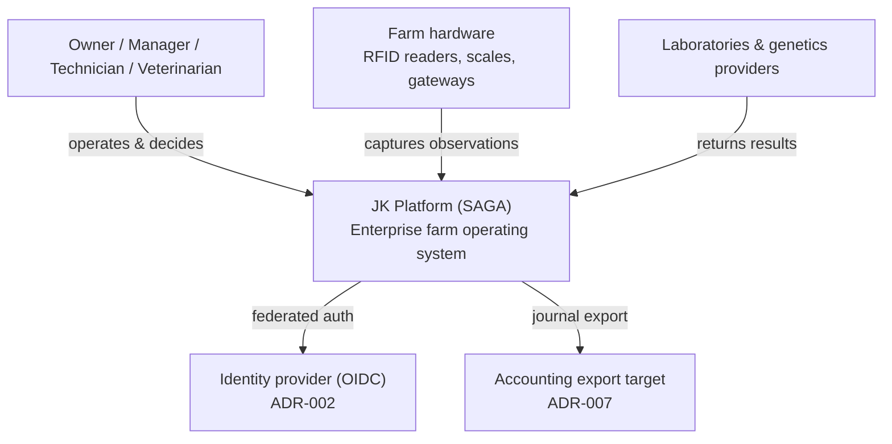
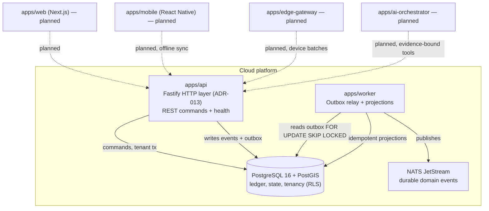

# Architecture — C4 Context & Container (Phase 0)

Mirrors JK-PLT-EES-001 Figures 3-4, annotated with what exists **today** vs
what is **specified** for later phases.

## System Context



**Today:** the platform, its data model, identity/tenancy, event ledger, API,
and worker exist. OIDC is wired as a verification skeleton (ADR-002 open).
Hardware, lab, genetics, and accounting integrations are later-phase adapters.

## Container view



## Implemented today vs specified

| Container                 | Spec (§30)                | Status                                                                 |
| ------------------------- | ------------------------- | ---------------------------------------------------------------------- |
| API                       | NestJS/Fastify            | **implemented** on Fastify (ADR-013)                                   |
| Worker/sync               | outbox relay, projections | **implemented** (relay + event-stats projector)                        |
| PostgreSQL + PostGIS      | system of record          | **implemented** (migrations 0001-0004, RLS)                            |
| NATS JetStream            | durable events            | **implemented** publisher (LogPublisher default; NATS when configured) |
| Redis                     | cache/locks               | specified; not yet used                                                |
| Object storage (S3/MinIO) | attachments               | specified; compose service present                                     |
| Web / Mobile / Edge / AI  | apps                      | **planned** (Volume XII phases)                                        |

## Command → event → projection flow (§31.1)

```mermaid
sequenceDiagram
  participant C as Client
  participant A as apps/api
  participant DB as PostgreSQL
  participant W as apps/worker
  participant N as NATS
  C->>A: command + Idempotency-Key + x-tenant-id
  A->>A: authenticate, build TenantContext, authorize
  A->>DB: BEGIN; SET LOCAL app.tenant_id
  A->>DB: write state + append domain_event + outbox_message
  A->>DB: COMMIT (atomic)
  A-->>C: 201 + correlationId
  W->>DB: poll outbox (FOR UPDATE SKIP LOCKED)
  W->>N: publish (msgID = eventId)
  W->>DB: mark published; idempotent projection upsert
```
